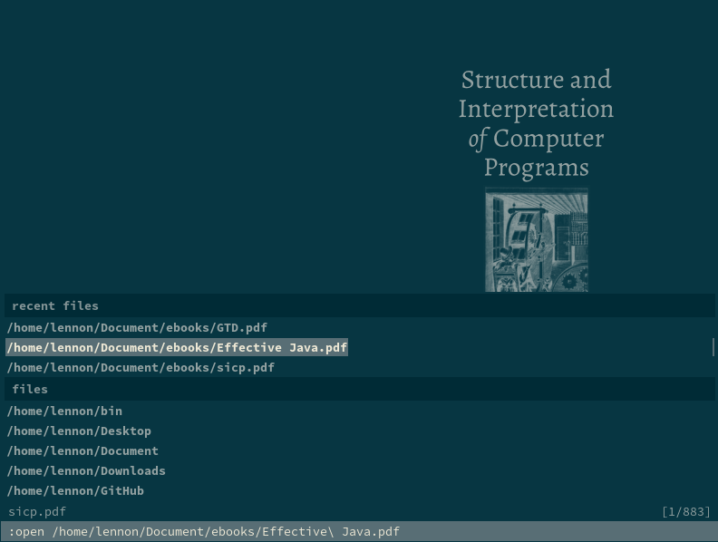
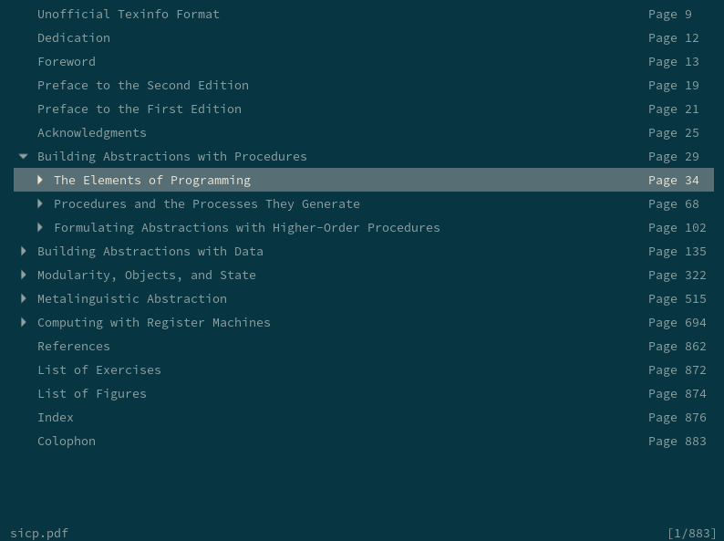

Solarized color scheme for the Zathura
=============================

Visit the [Solarized homepage]
------------------------------

See the [Solarized homepage] for screenshots, details and colorscheme versions for Vim, Mutt, popular terminal emulators and other applications.

Installation
------------
The dark or the light themes are available. To install the dark version please do the following:

        $ cd zathura-solarized
        $ cp zathura-solarized-dark ~/.config/zathura/zathurarc

To install the light version go with:

        $ cd zathura-solarized
        $ cp zathura-solarized-light ~/.config/zathura/zathurarc

Screenshots
-----------

[Solarized homepage]:   http://ethanschoonover.com/solarized
[Solarized repository]: https://github.com/altercation/solarized
[zathura-solarized repository]:  https://github.com/lennonwoo/zathura-solarized
